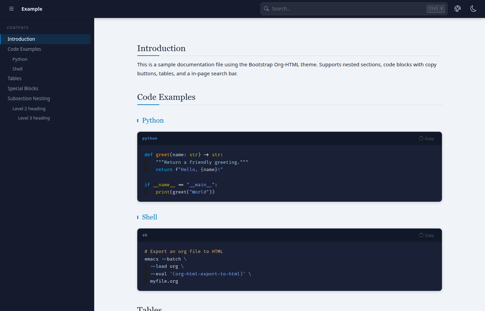
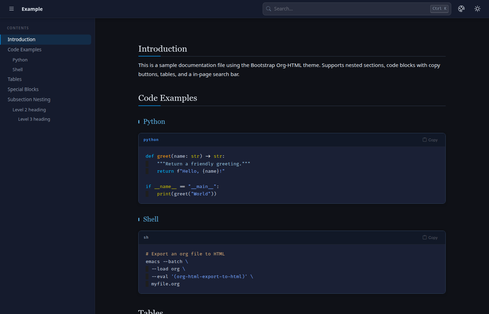

#+TITLE: orgmin-theme

A minimal-setup Bootstrap 5 documentation theme for Org mode HTML export.
One =#+SETUPFILE= line turns a plain =.org= file into a responsive doc site —
no local assets, everything is served from jsDelivr.

* Usage

Add one line at the top of your =.org= file:

#+begin_src org
#+SETUPFILE: https://cdn.jsdelivr.net/gh/yuqiuj-mob/orgmin-theme@main/bootstrap-orgdoc.setup
#+end_src

Then export as usual (=C-c C-e h h=, or in batch):

#+begin_src sh
emacs --batch --load org --eval '(org-html-export-to-html)' myfile.org
#+end_src

Pin a release instead of =@main= for reproducible output, e.g. =@v1.2.2=.
See [[./example.org][example.org]] / [[./example.html][example.html]] for a working demo.

* Features

- Responsive Bootstrap layout — top navbar, collapsible sidebar TOC with
  scroll-spy highlighting, mobile-friendly.
- Dark / light mode — follows the system preference, toggleable, remembered.
- Six accent palettes (Ocean, Forest, Sunset, Plum, Rose, Slate) with an
  in-page picker.
- In-page search (=Ctrl+K=) — orderless tokens, =*= / =?= globs, and
  =/regex/= queries.
- Code blocks with language badge and copy button.
- Mermaid diagrams, themed to match the active palette and dark mode.
- Special blocks (=#+begin_note=, =#+begin_warning=, =#+begin_tip=, …)
  rendered as Bootstrap alerts.
- Styled tables, blockquotes, footnotes, definition lists, back-to-top.

* Files

| =bootstrap-orgdoc.setup= | the =#+SETUPFILE= entry point (pins css/js to a tag) |
| =css/orgdoc.css=         | theme styles                                         |
| =js/orgdoc.js=           | layout build, search, toggles, mermaid               |
